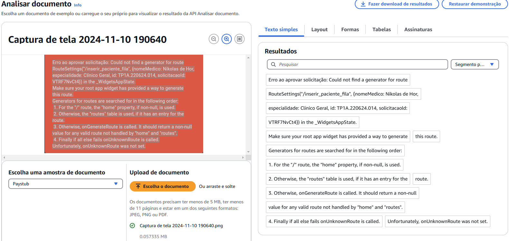

# Análise Avançada de Imagens e Texto com IA na AWS

Este projeto tem como objetivo demonstrar a utilização do **Amazon Textract**, um serviço de análise de texto de documentos da AWS, utilizando **Python** e **Boto3** para interação com a API.

## Objetivo do Projeto
- Implementar um sistema de extração de texto de documentos usando o **Amazon Textract**.
- Demonstrar o processamento de arquivos de imagem (PNG, JPG) e bytes em memória.
- Documentar o processo e os aprendizados adquiridos.

## Tecnologias Utilizadas
- **Python** 3.x
- **Boto3** (SDK AWS para Python)
- **Amazon Textract**
- **Amazon S3** (opcional para armazenamento de documentos)
- **Amazon SQS** (opcional para fila de processamento)

## Configuração do Ambiente
1. Instale as dependências necessárias:
   ```bash
   pip install boto3 mypy-boto3-textract
   ```
2. Configure suas credenciais AWS:
   ```bash
   aws configure
   ```
   - Insira sua `AWS Access Key ID` e `AWS Secret Access Key`.
   - Defina a região padrão de uso, como `us-east-1`.

## Implementação do Código
O seguinte código implementa a detecção de texto em documentos usando o **Amazon Textract**:

```python
import logging
from typing import Dict, Optional, Union
from botocore.exceptions import ClientError
import boto3
from mypy_boto3_textract import TextractClient  # Para type hints específicos

logger = logging.getLogger(__name__)

class TextDetectionFailure(Exception):
    pass

class InvalidDocumentState(Exception):
    pass

class TextractWrapper:
    def __init__(self, textract_client: TextractClient):
        self.textract_client = textract_client

    def _validate_document_input(self, document_file_name: Optional[str], document_bytes: Optional[bytes]) -> bytes:
        if not (document_file_name is None) ^ (document_bytes is None):
            raise InvalidDocumentState("Forneça exatamente um: document_file_name ou document_bytes")

        if document_file_name:
            try:
                with open(document_file_name, 'rb') as file:
                    return file.read()
            except FileNotFoundError:
                logger.error("Arquivo não encontrado: %s", document_file_name)
                raise

        return document_bytes  # type: ignore

    def detect_file_text(self, document_file_name: Optional[str] = None, document_bytes: Optional[bytes] = None) -> Dict:
        try:
            validated_bytes = self._validate_document_input(document_file_name, document_bytes)
            
            response = self.textract_client.detect_document_text(
                Document={'Bytes': validated_bytes}
            )
            
            logger.info("Detectados %d blocos", len(response['Blocks']))
            return response

        except ClientError as error:
            logger.exception("Falha na detecção de texto. Código: %s", error.response['Error']['Code'])
            raise TextDetectionFailure(error) from error
        except (FileNotFoundError, InvalidDocumentState) as error:
            raise
        except Exception as error:
            logger.exception("Erro inesperado durante o processamento")
            raise TextDetectionFailure(error) from error

    @staticmethod
    def extract_text_lines(response: Dict) -> list[str]:
        return [block['Text'] for block in response['Blocks'] if block['BlockType'] == 'LINE']
```

## Como Executar
1. Instancie o cliente Textract:
   ```python
   textract_client = boto3.client('textract')
   wrapper = TextractWrapper(textract_client)
   ```
2. Faça a análise de um documento local:
   ```python
   response = wrapper.detect_file_text(document_file_name='documento.png')
   texto_extraido = wrapper.extract_text_lines(response)
   print("\n".join(texto_extraido))
   ```

## Prints do Projeto
Aqui estão alguns prints do funcionamento do projeto:



## Aprendizados e Possíveis Melhorias
- **Aprendizados**
  - Uso do **Amazon Textract** para OCR em imagens.
  - Manipulação de documentos e extração de texto de forma estruturada.
  - Tratamento de erros e logging adequado.

- **Possíveis Melhorias**
  - Implementação de análise assíncrona para documentos longos.
  - Integração com **Amazon S3** para análise de documentos armazenados na nuvem.
  - Geração de relatórios automáticos com os dados extraídos.

## Contribuição
Sinta-se à vontade para clonar, modificar e contribuir com melhorias no projeto.

## Como Submeter o Projeto na DIO
1. Crie um repositório no GitHub.
2. Adicione o código e o arquivo `README.md` documentando o projeto.
3. Compartilhe o link do repositório na plataforma DIO pelo botão **"Entregar Projeto"**.

---

Este repositório faz parte do curso **"Análise Avançada de Imagens e Texto com IA na AWS"** da **DIO**. Bons estudos! 🚀
